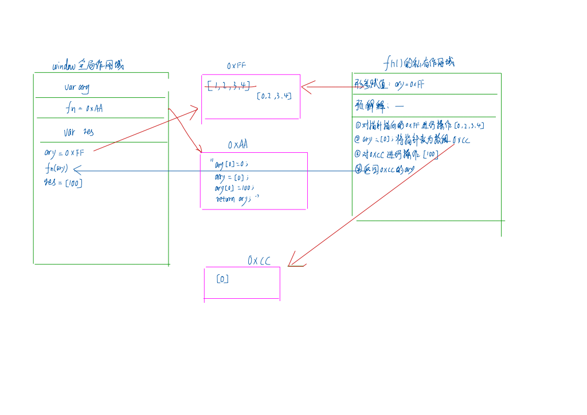
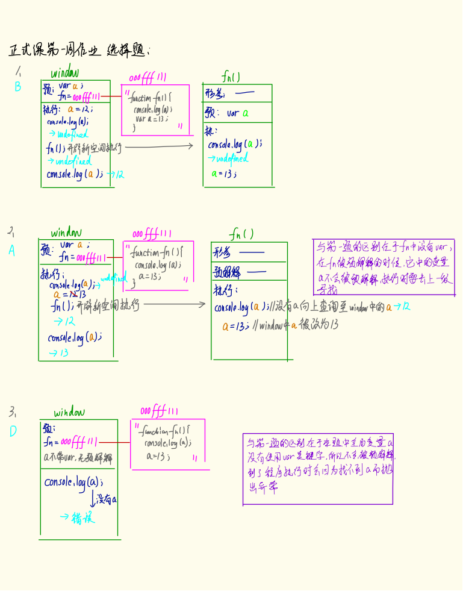
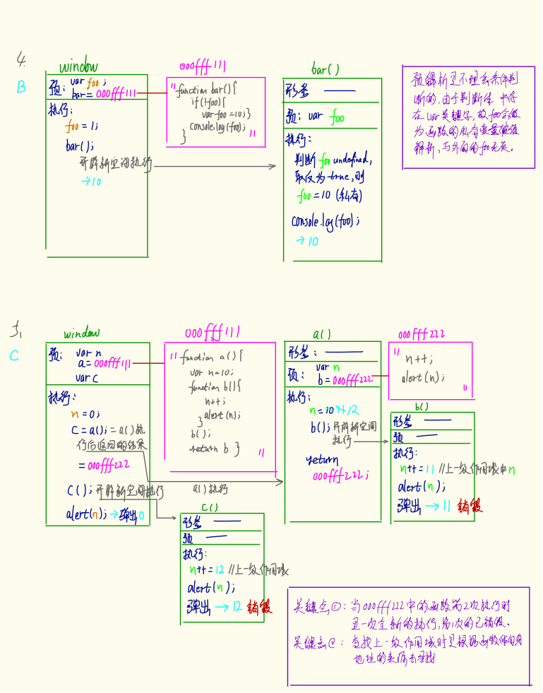
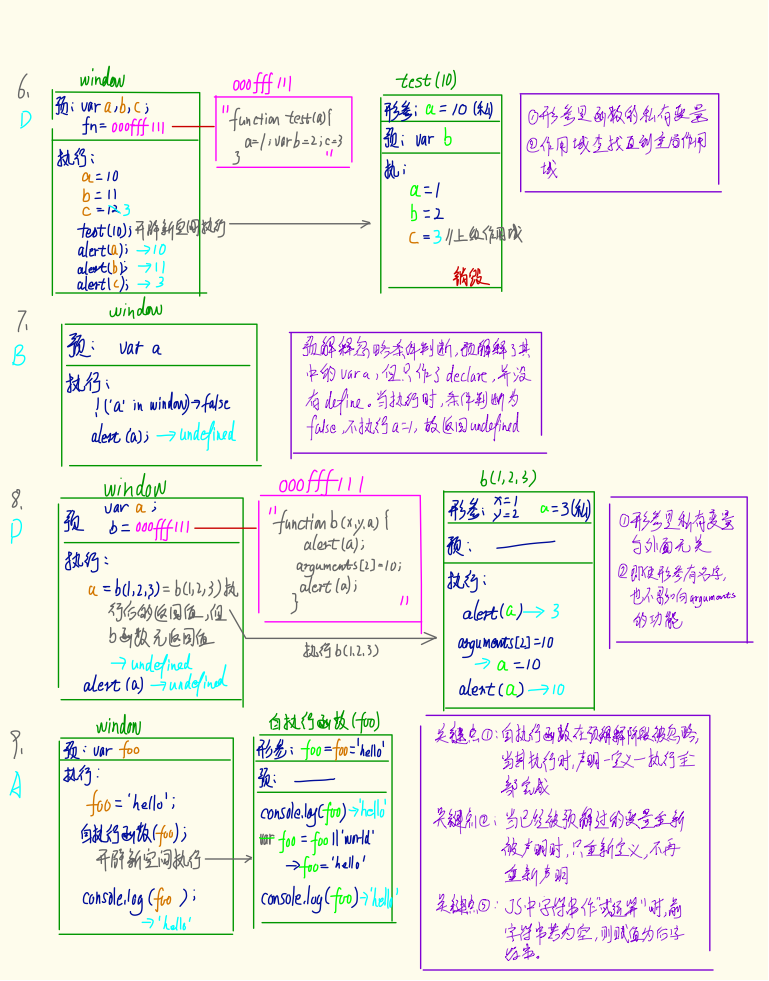
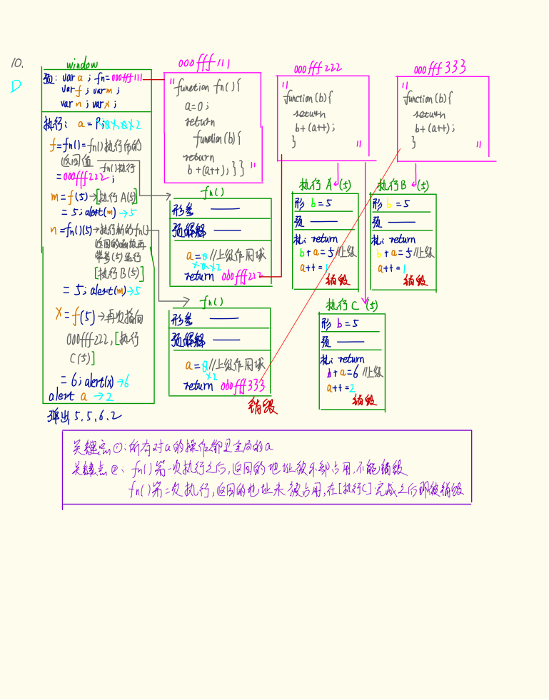
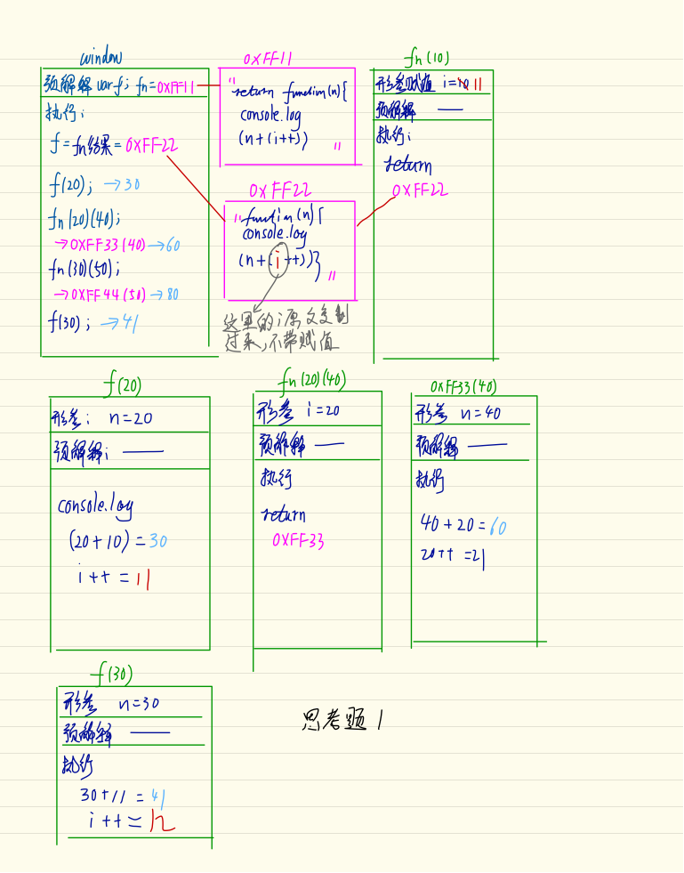
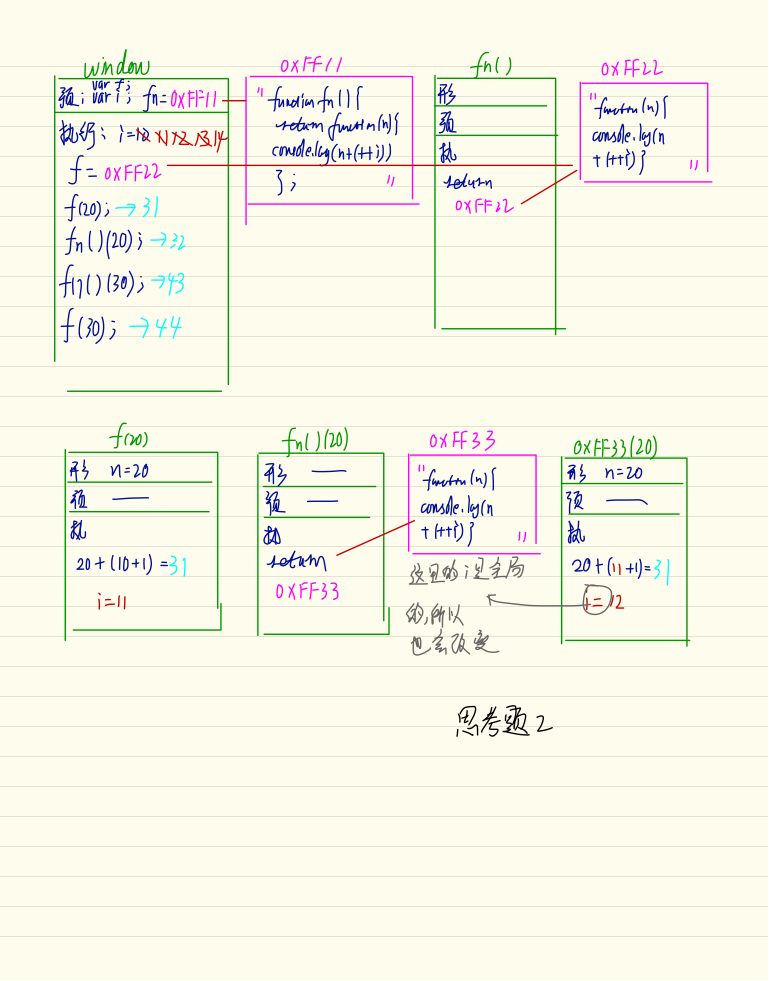
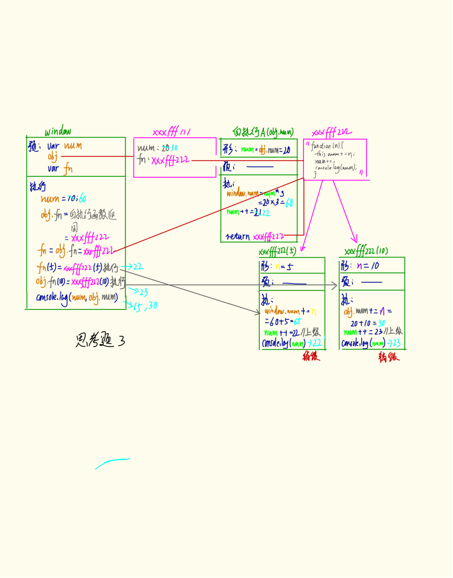
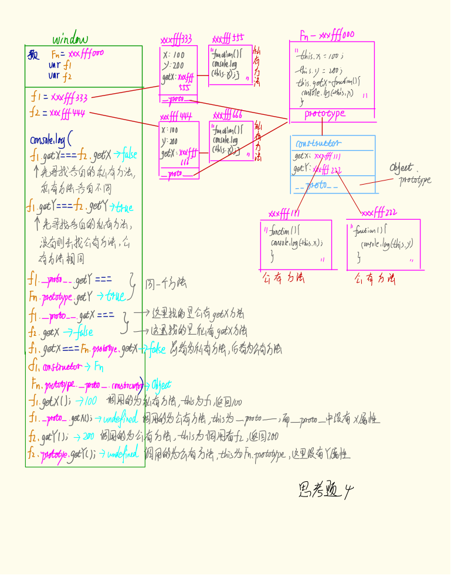

# 胡可第一周作业

***

## 1、珠峰培训正式课作业[第一周].doc

### 1.1 基础知识填空

#### 1.1.1

基本数据类型-Number、String、Boolean、Null、undefined

引用数据类型-Object（Object{}、Array[]、RegExp/!$/）、Function

基本数据类型直接操作值，变量与变量的值都位于栈内存中

引用数据类型操作对内存的引用，变量位于栈内存，变量的值位于堆内存

#### 1.1.2

typeof() / instanceof() / constructor / Object.prototype.toString.call()

isNaN

#### 1.1.3

形参 / arguments

### 1.2 DOM常用方法和属性

#### 1.2.1

```javascript
document.getElementById("div1");
context.getElementsByTagName("div")[i];
context.getElementsByClassName("w")[i];
context.getElementByName("h");
```

#### 1.2.2

```javascript
document.documentElement.ClientWidth || document.body.ClientWidth;
document.documentElement.ClientHeight || document.body.ClientHeight;
	
previousElementSibling;
function preV(curEle) {
	if("previousElementSibling" in curEle) {
		return curEle.previousElementSibling;
	}
	var pre = curEle.previousSibling;
	while (pre && pre.nodeType == 1) {
		pre = pre.previousSibling;
	}
	return pre;
}
```
	
#### 1.2.3

```javascript
var div1 = document.creatElement("div1");
document.body.appendChlid(div1);
document.body.insertBefore(div1.cloneNode(true), div1);
```
	
### 1.3 数组基础知识和运用

#### 1.3.1

```javascript
ary.length--;
ary.pop();
ary.splice(ary.length-1, 1);

ary[ary.length] = newValue;
ary.push(newValue);
ary.splice(ary.length, 0, newValue);
```
	
#### 1.3.2

```javascript
ary.slice(0);/ary.slice();
ary.splice(0);//对原数组有修改
ary.concat();
ary.map(function(n) {
			return n;
		});
```
			
#### 1.3.3

```javascript
sort(function(a, b) {
	return a-b;
});

slice(n-1, m);
```

### 1.4 写出下面表达式的运算结果

**true** //0 == 0

**true** //false == false

**true** //[]=false -> 0 == 0

**false** //Nan == NaN

**51** //53 - 2

**false** //"3px" * 3 -> false

**true** //"3px" + 3 -> true

**"OK"** //document.body -> true

**""** //[] -> ""

**true** //null == undefined

### 1.5 按钮绑定事件更换颜色

```javascript
var ary = ["red", "yellow", "pink", "green", "blue"];
var oBtns = document.getElementsByTagName('input');
function bindEvent(index) {
	document.body.style.backgroundColor = ary[index];
}
for (var i = 0; i < oBtns.length; i++) {
	oBtns[i].index = i;
	oBtns[i].onclick = function () {
		bindEvent(this.index);
	}
}
```

### 1.6 360面试题

```javascript
var ary=[1,2,3,4];
function fn(ary){ 
	ary[0]=0;
	ary=[0];
	ary[0]=100;
	return ary; 
}
var res=fn(ary);
console.log(ary);
console.log(res);//此题偏难，认真思考(360 面试题难度降低版本代码)
```

-> [0, 2, 3, 4]

-> [100]

图示：



### 1.7 选择题

```javascript
//1、  
console.log(a);
var a=12;
function fn(){
	console.log(a);
	var a=13;
}
fn();   
console.log(a);  
/*输出的三次分别是多少
A、undefined   12 13              B、undefined undefined 12   
C、undefined undefined 13          D、有程序报错*/

//2、
console.log(a);
var a=12;
function fn(){
	console.log(a);
	a=13;
}
fn();
console.log(a); 
/*A、undefined   12 13              B、undefined undefined 12   
C、undefined undefined 13          D、有程序报错*/

//3、
console.log(a);
a=12;
function fn(){
	console.log(a);
	a=13;
}
fn();
console.log(a);   
/*输出的三次分别是多少
A、undefined   12 13              B、undefined undefined 12   
C、undefined undefined 13          D、有程序报错*/
```



```javascript
//4、
var foo=1; 
function bar(){
	if(!foo){
	var foo=10;
}
console.log(foo);
}
bar();   
/*输出的结果是多少
A、1       B、10        C、undefined     D、报错*/

//5、
var n=0;
function a(){
	var n=10;
	function b(){
		n++;
		alert(n);
	}
	b();
	return b;
}
var c=a();
c(); 
alert(n);
/*弹出三次的结果分别是什么？
A、1 1 1     B、11 11 0    C、11 12 0  D、11 12 12*/
```



```javascript
//6、
var a=10,b=11,c=12;
function test(a){
	a=1;
	var b=2;
	c=3;
}
test(10);
alert(a);   
alert(b);    
alert(c);     
/*弹出的三个值分别是多少？
A、1 11 3    B、10 11 12   C、1 2 3    D、10 11 3*/

//7、
if(!("a" in window)){
	var a=1;
}
alert(a);  
/*弹出的 a 的值是？
A、1    B、undefined      C、报错   D、以上答案都丌对*/

//8、
var a=4;
function b(x,y,a) { 
	alert(a);
	arguments[2]=10;        
	alert(a);
}
a=b(1,2,3);    
alert(a);   
/*三次弹出的结果是 
A、3   3   4    B、3   10   4    C、3   10   10     D、3   10   undefined */

//9、
var foo='hello';
(function(foo){
	console.log(foo);
	var foo=foo||'world';
	console.log(foo);
})(foo);
console.log(foo);  
/*三次分别输出什么？
A、hello hello hello      B、undefined world   hello    
C、hello world world    D、以上答案都不正确*/
```



```javascript
//10、
var a=9; 
function fn(){
	a=0;   
	return function(b){ return b+a++; }    
}
var f=fn();
var m=f(5);alert(m);
var n=fn()(5);alert(n); 
var x=f(5);alert(x);
alert(a);   
/*弹出的四次结果？
A、6 6 7 2    B、5 6 7 3     
C、5 5 6 3      D、以上答案都不正确*/
```



### 1.8 思考题

#### 1.8.1

```javascript
document.parentNode; //->null
```
	
document已经是DOM结构中的顶层，没有父节点。document对象中存在parentNode属性，其值自然为null，表示没有父节点。

#### 1.8.2

```javascript
document.parentnode; //->undefined
```

document对象中并没有parentnode属性，当尝试读取对象不存在的属性时会返回 undefined。

#### 1.8.3

`prototype`是类的属性，它是一个对象数据类型，指向一个堆内存，内部保存着该类的`constructor`（指向类本身）、类的公共实例方法，以及`__proto__`（指向此对象所属类的`prototype`）。两者是JavaScript实现原型链的关键，类实例的`__proto__`指向它所属类的`prototype`。这样当调用一个实例的方法时，实例首先会查找自己的私有属性及方法，如果找到了就直接调用，如果没找到就通过`__proto__`找到其所属类的`prototype`上的公有属性，如果有就直接调用，如果没有则继续向上查找，直至找到`Object.prototype`，没有的话返回`undefined`。

#### 1.8.4

`hasOwnProperty`是判断一个属性是否是该实例的私有属性（不管公有有没有），`in`则是判断一个实例是否存在该属性。

```javascript
anObject.hasOwnProperty("toString"); ->Boolean
if (toString in anObject） {...} -> if (Boolean) {...}
```

#### 1.8.5

函数运行时，会形成一个私有作用域，用以保证内部的私有变量不受外界的干扰。这种机制叫做闭包。

### 1.9附加题

#### 1.9.1

```javascript
function fn(i) {
    return function (n) {
        console.log(n + (i++));
    }
}
var f = fn(10);
f(20);
fn(20)(40);
fn(30)(50);
f(30);
```



#### 1.9.2

```javascript
var i = 10;
function fn() {
    return function (n) {
        console.log(n + (++i));
    }
}
var f = fn();
f(20);
fn()(20);
fn()(30);
f(30);
```



#### 1.9.3

```javascript
var num = 10;
var obj = {num: 20};
obj.fn = (function (num) {
	this.num = num * 3;
	num++;
	return function (n) {
		this.num += n;
		num++;
		console.log(num); 
	}
	})(obj.num);
var fn = obj.fn;
fn(5);
obj.fn(10);
console.log(num, obj.num);
```



#### 1.9.4

```javascript
function Fn() {
	this.x = 100;
	this.y = 200;
	this.getX = function () {
		console.log(this.x);
		}
}
Fn.prototype.getX = function () {
	console.log(this.x);
	};
Fn.prototype.getY = function () {
	console.log(this.y);
	}; 
var f1 = new Fn;
var f2 = new Fn;
console.log(f1.getX === f2.getX);
console.log(f1.getY === f2.getY);
console.log(f1.__proto__.getY === Fn.prototype.getY);
console.log(f1.__proto__.getX === f2.getX);
console.log(f1.getX === Fn.prototype.getX);
console.log(f1.constructor);
console.log(Fn.prototype.__proto__.constructor);
f1.getX();
f1.__proto__.getX();
f2.getY();
Fn.prototype.getY();
```



## 2、事件绑定的几种方案

共用部分:

```javascript
var tab = document.getElementById('tab');
var oLis = tab.getElementsByTagName('li');
var oDivs = tab.getElementsByTagName('div');

function changeTab(index) {
	for (var i = 0; i < oLis.length; i++) {
		oLis[i].className = "";
		oDivs[i].className = "";
	}
	oLis[index].className = "select";
	oDivs[index].className = "select";
}
```

* 下面是事件绑定部分第一种方案：使用闭包①

> 缺点：多形成了一个不销毁私有作用域。

```javascript
for (var i = 0; i < oLis.length; i++) {
	(function (i) {
		oLis[i].onmouseover = function() {
			changeTab(i);
		}
	})(i);
}
```

* 下面是事件绑定部分第二种方案：使用闭包②

> 缺点：多形成了一个不销毁私有作用域。

```javascript
for (var i = 0; i < oLis.length; i++) {
	oLis[i].onmouseover = (function (i) {
		return function(){
			changeTab(i);
		};
	})(i);
}
```

* 下面是事件绑定部分第三种方案：自定义属性

> 最优方案

```javascript
for (var i = 0; i < oLis.length; i++) {
	oLis[i].index = i;
	oLis[i].onmouseover = function() {
		changeTab(this.index);
	};
}
```


