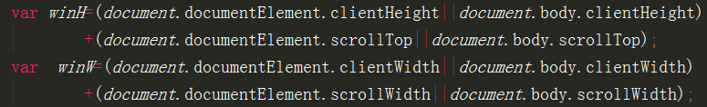
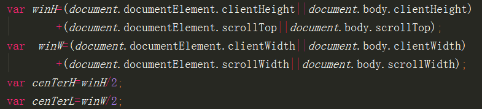
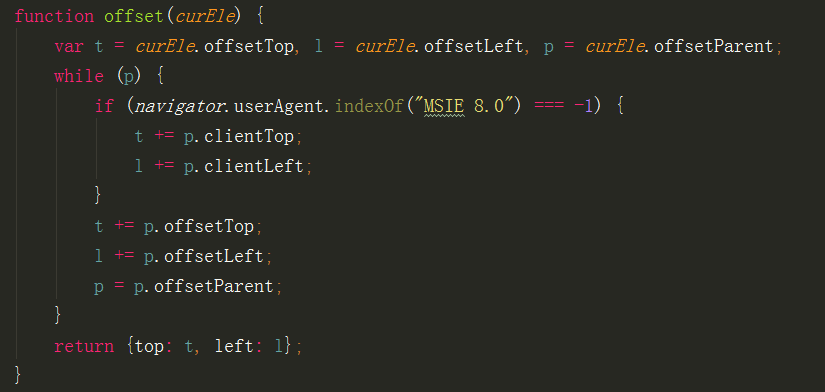
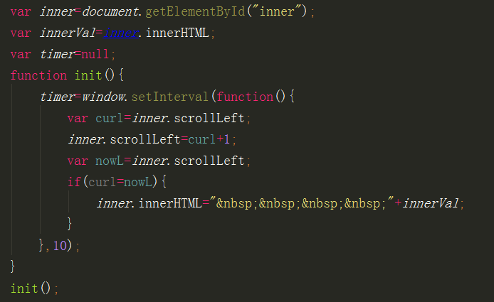

1、clientWidth和offsetWidth的区别是什么？
clientWidth是内容的宽度+左右padding
offsetWidth是内容的宽度+左右padding+左右border

2、offsetLeft是什么，什么情况下会产生offsetLeft（offsetLeft的值包括那些，或从哪儿开始算的）
offsetLeft是盒子的左偏移量，盒子有父亲参照物的情况下就会产生offsetLeft。在标准浏览器下它包括盒子的margin+父级参照物的border，在IE8下只加margin，因为border已经算在内了。

3、offsetParent是什么?在什么情况下，一个网页元素会变成下级(后代)元素的offsetParent?
offsetParent是父级参照物。在盒子做了定位的position情况下，一个网页元素会变成下级(后代)元素的offsetParen

4、如何算出浏览器的高度或宽度。

5、如何算浏览器中当前显示的页面的中心点的位置

6、算出页面上任意元素的绝对位置（距离浏览器顶部的）;

7、如何判断是什么浏览器和浏览器的版本号？
window.navigator.userAgent
8、使用scrollTop或scrollLeft实现一个文字无缝滚动的效果。

9、关于逻辑运算的一些题：
var a=false,b=9,c="  ";
var result=a||b&&c;//问：这会result的结果
答：""
var result=a&&b&&c;//问：这会result的结果
答：""
result=c&&b&&a;//问：这会result的结果
答：9
10、setTimeout和setInterval的返回值是什么类型的，它俩有什么区别？
是function， setTimeout执行时载入时间后，执行一次，setInterval执行时载入时间后，每隔指定的时间后执行一次（他可以执行多次）